# RetailGuard Copilot 产品需求文档（PRD）

> 文档定位：**界面骨架 + 用户故事 + 数据流 + 演示脚本**。承接 `需求.md`（业务诉求），下游对接 `设计.md`（技术方案）。
> 阅读顺序：先 §2~§3 看清角色和入口 → §4~§5 看页面与流转 → §6 钻 20 条 story → §7 状态机 → §8 拿演示剧本去走查。
> 所有界面用 Mermaid 表达，避免脱离仓库的设计稿失同步。

---

## 1. 文档说明

| 维度 | 内容 |
|---|---|
| 上游依赖 | `需求.md`（业务侧诉求 / 验收线 / 数据规模） |
| 下游依赖 | `设计.md`（技术架构 / DB 表 / API 契约 / Agent 拓扑） |
| 演进规则 | 任何 UI/字段/AC 变更同步本文档，禁止"改完不留痕" |
| 命名约定 | 中文标题 + 英文页面/组件标识（与代码保持映射） |

---

## 2. 角色与权限矩阵

### 2.1 按钮级权限矩阵（节选核心，完整版见 §6 各 story AC）

> 标记说明：✅ 允许 / ❌ 拒绝 / ⚠️ 受限（需二次确认或仅看自己）

| 模块 | 操作（按钮/接口） | 顾客 | 客服 | 风控 | 管理员 |
|---|---|---|---|---|---|
| 登录 | 提交登录 | ✅ | ✅ | ✅ | ✅ |
| 登录 | 注册（不做） | ❌ | ❌ | ❌ | ❌ |
| 会话 | 发起新对话 | ✅ | ✅ | ❌ | ❌ |
| 会话 | 查看自己历史 | ✅ | ✅ | ❌ | ❌ |
| 会话 | 查看他人会话 | ❌ | ⚠️ 同租户 | ❌ | ✅ 全租户 |
| 会话 | 接管对话 | ❌ | ✅ | ❌ | ❌ |
| 工单 | 新建工单 | ✅ | ✅ | ❌ | ❌ |
| 工单 | 改派 / 结案 | ❌ | ✅ | ❌ | ✅ |
| 退款 | 申请退款 | ✅ | ✅ 代客 | ❌ | ❌ |
| 退款 | 审批退款 | ❌ | ⚠️ 小额 | ✅ | ✅ |
| 风控 | 查看决策链 | ❌ | ⚠️ 只读 | ✅ | ✅ |
| 风控 | Approve / Reject | ❌ | ❌ | ✅ | ✅ |
| 风控 | 配置规则权重 | ❌ | ❌ | ❌ | ✅ |
| 灰度 | 查看 v1/v2/v3 指标 | ❌ | ❌ | ❌ | ✅ |
| 灰度 | 调整流量权重 | ❌ | ❌ | ❌ | ✅ |
| 租户 | 列表查看 | ❌ | ❌ | ❌ | ✅ |
| 租户 | 新建/停用 | ❌ | ❌ | ❌ | ✅ |
| 成本 | 查看 token 成本曲线 | ❌ | ❌ | ❌ | ✅ |
| 观测 | 看 trace 详情 | ❌ | ⚠️ 自己会话 | ⚠️ 自己审过 | ✅ |

### 2.2 RBAC 映射规则

- 前端：每个 `<button>` 绑定 `v-permission="ROLE:ACTION"`，无权限直接不渲染
- 后端：FastAPI 依赖 `Depends(require_role("admin"))` + `Depends(require_tenant_match)` 双闸门
- 接口 403 与按钮缺失保持一致（避免暴露存在性）
- 跨租户访问 → 后端返回 404 而非 403（防止枚举攻击）

---

## 3. 信息架构

### 3.1 全站页面树

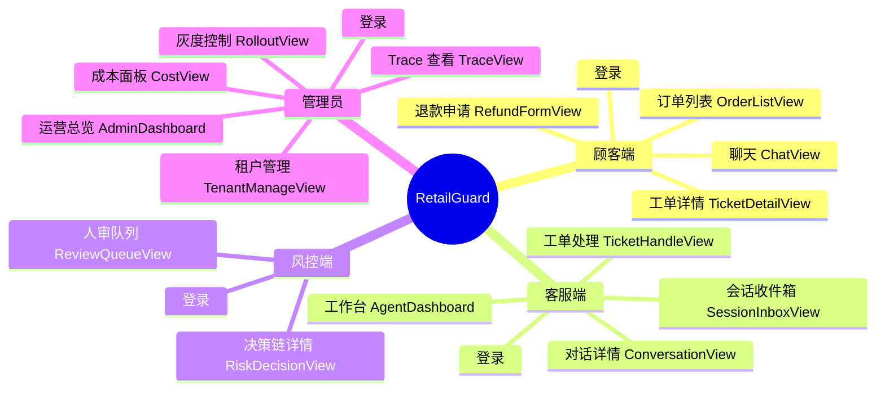
```mermaid
mindmap
  root((RetailGuard))
    顾客端
      登录
      聊天 ChatView
      订单列表 OrderListView
      工单详情 TicketDetailView
      退款申请 RefundFormView
    客服端
      登录
      工作台 AgentDashboard
      会话收件箱 SessionInboxView
      对话详情 ConversationView
      工单处理 TicketHandleView
    风控端
      登录
      人审队列 ReviewQueueView
      决策链详情 RiskDecisionView
    管理员
      登录
      运营总览 AdminDashboard
      灰度控制 RolloutView
      租户管理 TenantManageView
      成本面板 CostView
      Trace 查看 TraceView
```

### 3.2 角色入口与默认落地页

| 角色 | 登录后落地页 | 默认导航 |
|---|---|---|
| 顾客 | ChatView | 聊天 / 我的订单 / 我的工单 |
| 客服 | AgentDashboard | 待办 / 会话 / 工单 / 知识库 |
| 风控 | ReviewQueueView | 人审队列 / 历史决策 |
| 管理员 | AdminDashboard | 总览 / 灰度 / 租户 / 成本 / Trace |

---

## 4. 页面骨架（box layout）

> 用 Mermaid flowchart 模拟 box 布局：`TB` 表示从上到下层叠，`LR` 表示左右排布。所有节点用 `[文字]` 表示框，`(())` 表示按钮，虚线表示触发跳转。

### 4.1 顾客端

#### 4.1.1 ChatView（核心）

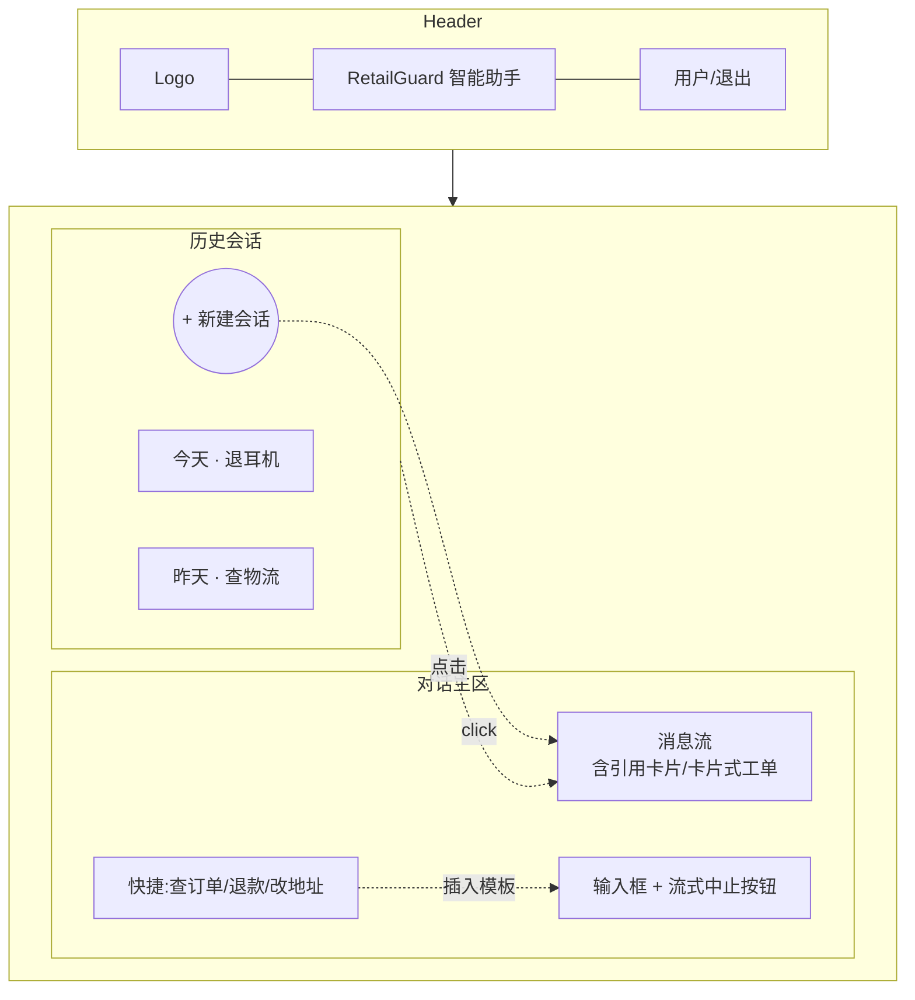
```mermaid
flowchart TB
    subgraph Header
      Logo[Logo] --- Title[RetailGuard 智能助手] --- UserMenu[用户/退出]
    end
    subgraph Body[" "]
      direction LR
      subgraph LeftRail[历史会话]
        Session1[今天 · 退耳机]
        Session2[昨天 · 查物流]
        NewBtn((+ 新建会话))
      end
      subgraph Main[对话主区]
        MsgList[消息流<br/>含引用卡片/卡片式工单]
        InputBox[输入框 + 流式中止按钮]
        QuickActions[快捷:查订单/退款/改地址]
      end
    end
    Header --> Body
    LeftRail -.点击.-> MsgList
    NewBtn -.click.-> MsgList
    QuickActions -.插入模板.-> InputBox
```

**关键交互**：
- 引用卡片可点击 → 抽屉展开 KB 原文
- "申请退款"动作 → 弹出 RefundFormView 模态框
- 流式生成中可中止；中止后保留前缀文本

#### 4.1.2 OrderListView

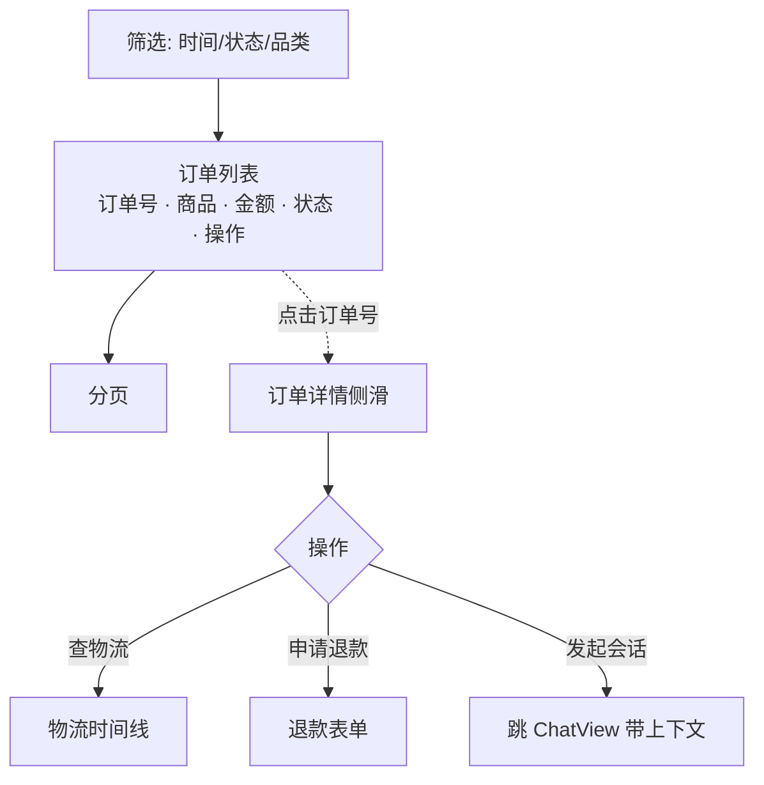
```mermaid
flowchart TB
    Filter[筛选: 时间/状态/品类] --> Table[订单列表<br/>订单号 · 商品 · 金额 · 状态 · 操作]
    Table --> Pager[分页]
    Table -.点击订单号.-> Detail[订单详情侧滑]
    Detail --> Actions{操作}
    Actions -->|查物流| Track[物流时间线]
    Actions -->|申请退款| RefundForm[退款表单]
    Actions -->|发起会话| Chat[跳 ChatView 带上下文]
```

#### 4.1.3 RefundFormView（模态/路由皆可）

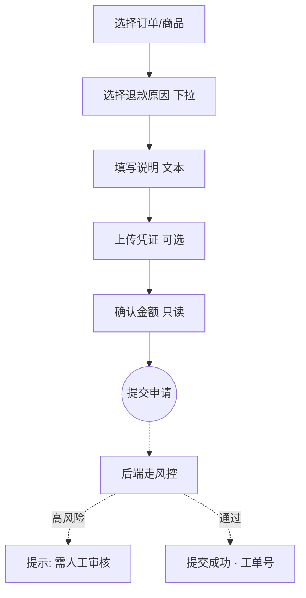
```mermaid
flowchart TB
    F1[选择订单/商品]
    F2[选择退款原因 下拉]
    F3[填写说明 文本]
    F4[上传凭证 可选]
    F5[确认金额 只读]
    Submit((提交申请))
    F1-->F2-->F3-->F4-->F5-->Submit
    Submit -.->Risk[后端走风控]
    Risk -.高风险.->Wait[提示: 需人工审核]
    Risk -.通过.->Done[提交成功 · 工单号]
```

### 4.2 客服端

#### 4.2.1 AgentDashboard

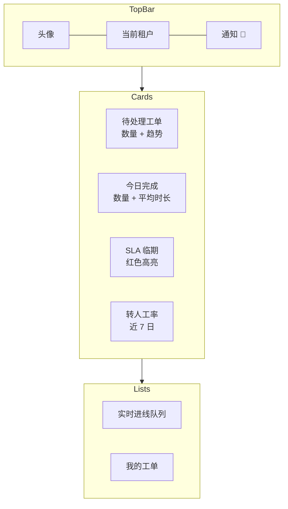
```mermaid
flowchart TB
    subgraph TopBar
      Avatar[头像] --- TenantSelector[当前租户] --- Notify[通知 🔔]
    end
    subgraph Cards
      direction LR
      C1[待处理工单<br/>数量 + 趋势]
      C2[今日完成<br/>数量 + 平均时长]
      C3[SLA 临期<br/>红色高亮]
      C4[转人工率<br/>近 7 日]
    end
    subgraph Lists
      direction LR
      Queue[实时进线队列]
      Mine[我的工单]
    end
    TopBar-->Cards-->Lists
```

#### 4.2.2 ConversationView（接管 / 旁观）

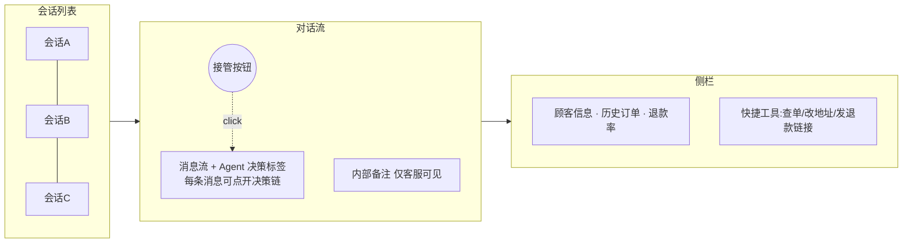
```mermaid
flowchart LR
    subgraph Left[会话列表]
      S1[会话A] --- S2[会话B] --- S3[会话C]
    end
    subgraph Center[对话流]
      Msg[消息流 + Agent 决策标签<br/>每条消息可点开决策链]
      Take((接管按钮))
      Note[内部备注 仅客服可见]
    end
    subgraph Right[侧栏]
      UserInfo[顾客信息 · 历史订单 · 退款率]
      Tools[快捷工具:查单/改地址/发退款链接]
    end
    Left --> Center --> Right
    Take -.click.-> Msg
```

#### 4.2.3 TicketHandleView

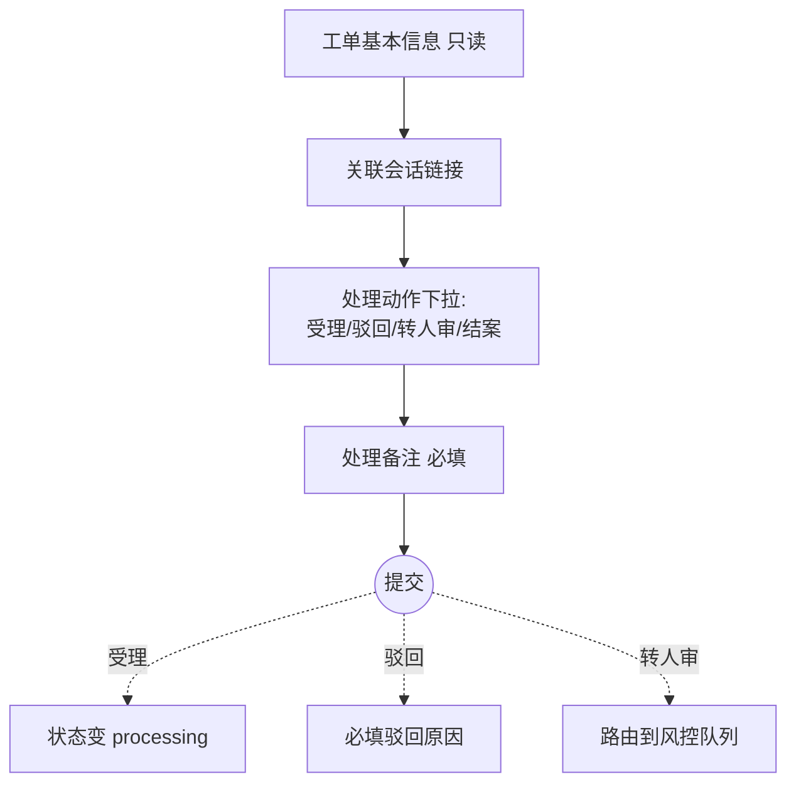
```mermaid
flowchart TB
    T1[工单基本信息 只读]
    T2[关联会话链接]
    T3[处理动作下拉:<br/>受理/驳回/转人审/结案]
    T4[处理备注 必填]
    Submit((提交))
    T1-->T2-->T3-->T4-->Submit
    Submit -.受理.->Status[状态变 processing]
    Submit -.驳回.->Reason[必填驳回原因]
    Submit -.转人审.->Review[路由到风控队列]
```

### 4.3 风控端

#### 4.3.1 ReviewQueueView

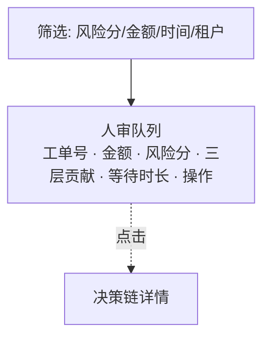
```mermaid
flowchart TB
    Filter[筛选: 风险分/金额/时间/租户]
    Table[人审队列<br/>工单号 · 金额 · 风险分 · 三层贡献 · 等待时长 · 操作]
    Table -.点击.-> Detail[决策链详情]
    Filter --> Table
```

#### 4.3.2 RiskDecisionView（核心 · 决策链可视化）

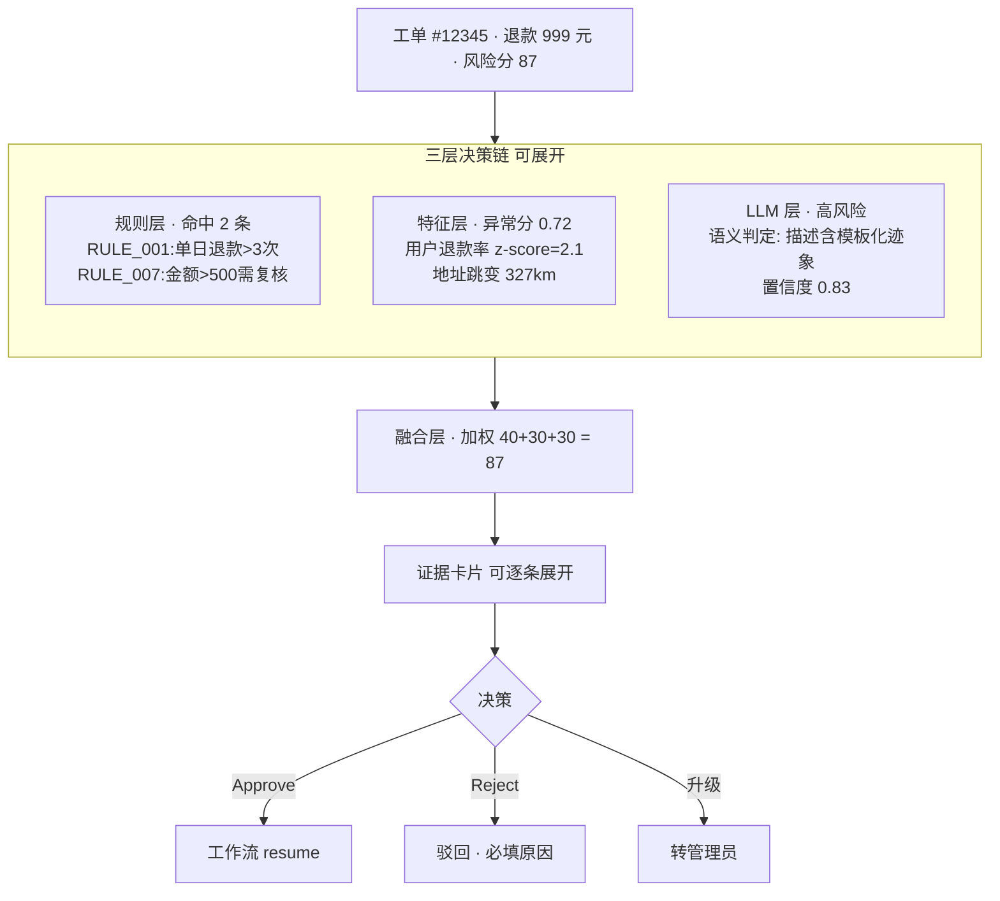
```mermaid
flowchart TB
    Header[工单 #12345 · 退款 999 元 · 风险分 87]
    subgraph Tree[三层决策链 可展开]
      direction TB
      L1[规则层 · 命中 2 条<br/>RULE_001:单日退款>3次<br/>RULE_007:金额>500需复核]
      L2[特征层 · 异常分 0.72<br/>用户退款率 z-score=2.1<br/>地址跳变 327km]
      L3[LLM 层 · 高风险<br/>语义判定: 描述含模板化迹象<br/>置信度 0.83]
    end
    Fusion[融合层 · 加权 40+30+30 = 87]
    Evidence[证据卡片 可逐条展开]
    Actions{决策}
    Actions -->|Approve| Resume[工作流 resume]
    Actions -->|Reject| Reject[驳回 · 必填原因]
    Actions -->|升级| Escalate[转管理员]
    Header --> Tree --> Fusion --> Evidence --> Actions
```

### 4.4 管理员

#### 4.4.1 AdminDashboard

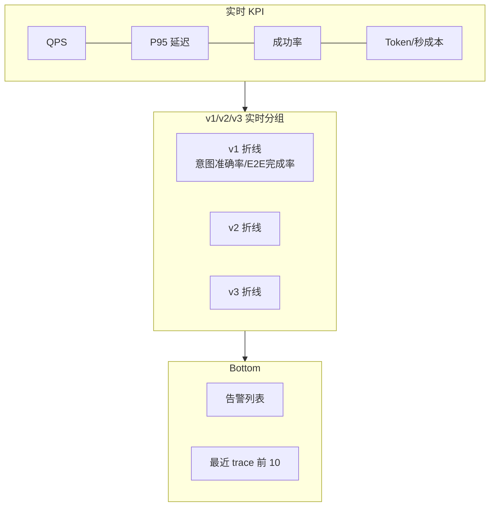
```mermaid
flowchart TB
    subgraph KPI[实时 KPI]
      direction LR
      K1[QPS] --- K2[P95 延迟] --- K3[成功率] --- K4[Token/秒成本]
    end
    subgraph VersionPanel[v1/v2/v3 实时分组]
      direction LR
      V1[v1 折线<br/>意图准确率/E2E完成率]
      V2[v2 折线]
      V3[v3 折线]
    end
    subgraph Bottom
      direction LR
      Alerts[告警列表]
      RecentTraces[最近 trace 前 10]
    end
    KPI --> VersionPanel --> Bottom
```

#### 4.4.2 RolloutView

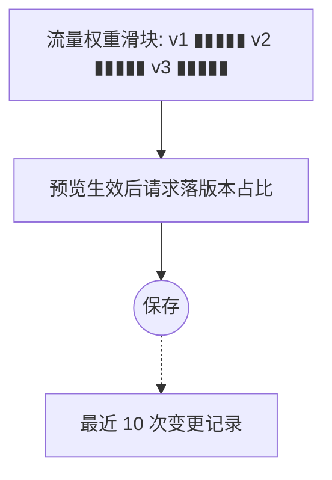
```mermaid
flowchart TB
    Slider[流量权重滑块: v1 ▮▮▮▮▮ v2 ▮▮▮▮▮ v3 ▮▮▮▮▮]
    Preview[预览生效后请求落版本占比]
    Save((保存))
    Audit[最近 10 次变更记录]
    Slider --> Preview --> Save
    Save -.->Audit
```

#### 4.4.3 TenantManageView

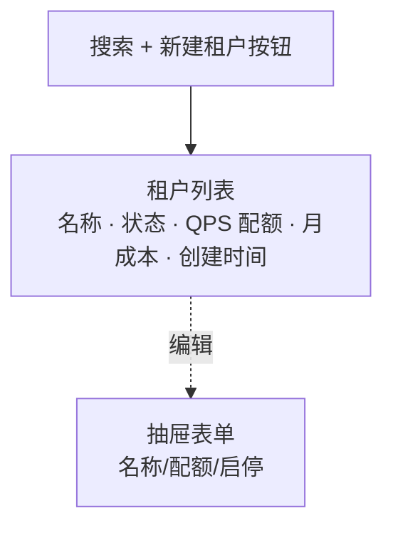
```mermaid
flowchart TB
    Toolbar[搜索 + 新建租户按钮]
    Table[租户列表<br/>名称 · 状态 · QPS 配额 · 月成本 · 创建时间]
    Table -.编辑.-> EditDrawer[抽屉表单<br/>名称/配额/启停]
    Toolbar --> Table
```

#### 4.4.4 CostView

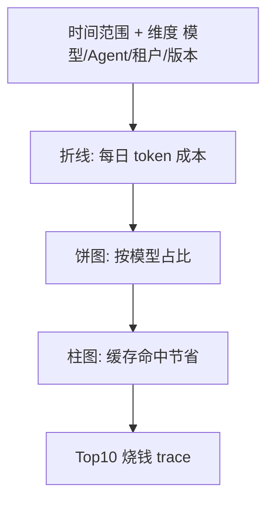
```mermaid
flowchart TB
    Filter[时间范围 + 维度 模型/Agent/租户/版本]
    Chart1[折线: 每日 token 成本]
    Chart2[饼图: 按模型占比]
    Chart3[柱图: 缓存命中节省]
    Table[Top10 烧钱 trace]
    Filter --> Chart1 --> Chart2 --> Chart3 --> Table
```

#### 4.4.5 TraceView

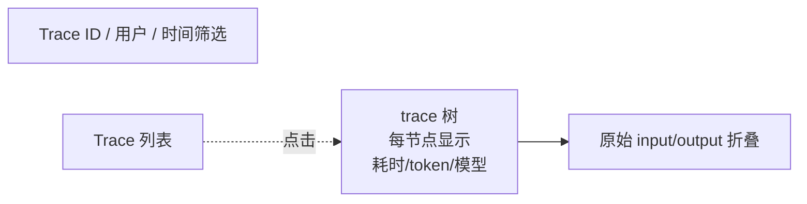
```mermaid
flowchart LR
    Search[Trace ID / 用户 / 时间筛选]
    List[Trace 列表]
    List -.点击.-> Tree[trace 树<br/>每节点显示<br/>耗时/token/模型]
    Tree --> JSON[原始 input/output 折叠]
```

---

## 5. 流转图（5 个核心 sequenceDiagram）

### 5.1 顾客提问 → RAG 流程

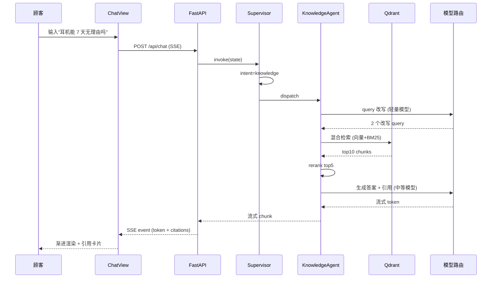
```mermaid
sequenceDiagram
    participant U as 顾客
    participant FE as ChatView
    participant API as FastAPI
    participant SUP as Supervisor
    participant KA as KnowledgeAgent
    participant VDB as Qdrant
    participant LLM as 模型路由

    U->>FE: 输入"耳机能 7 天无理由吗"
    FE->>API: POST /api/chat (SSE)
    API->>SUP: invoke(state)
    SUP->>SUP: intent=knowledge
    SUP->>KA: dispatch
    KA->>LLM: query 改写 (轻量模型)
    LLM-->>KA: 2 个改写 query
    KA->>VDB: 混合检索 (向量+BM25)
    VDB-->>KA: top10 chunks
    KA->>KA: rerank top5
    KA->>LLM: 生成答案 + 引用 (中等模型)
    LLM-->>KA: 流式 token
    KA-->>API: 流式 chunk
    API-->>FE: SSE event (token + citations)
    FE-->>U: 渐进渲染 + 引用卡片
```

### 5.2 复杂退款 → Planner + Critic + Interrupt

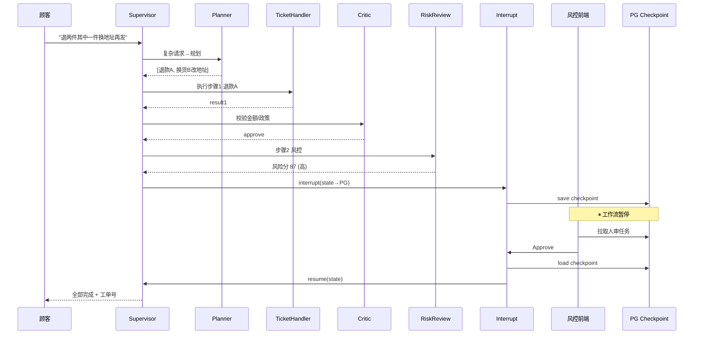
```mermaid
sequenceDiagram
    participant U as 顾客
    participant SUP as Supervisor
    participant PL as Planner
    participant TH as TicketHandler
    participant CR as Critic
    participant RR as RiskReview
    participant INT as Interrupt
    participant FE as 风控前端
    participant PG as PG Checkpoint

    U->>SUP: "退两件其中一件换地址再发"
    SUP->>PL: 复杂请求→规划
    PL-->>SUP: [退款A, 换货B改地址]
    SUP->>TH: 执行步骤1 退款A
    TH-->>SUP: result1
    SUP->>CR: 校验金额/政策
    CR-->>SUP: approve
    SUP->>RR: 步骤2 风控
    RR-->>SUP: 风险分 87 (高)
    SUP->>INT: interrupt(state→PG)
    INT->>PG: save checkpoint
    Note over FE,PG: ⏸ 工作流暂停
    FE->>PG: 拉取人审任务
    FE->>INT: Approve
    INT->>PG: load checkpoint
    INT->>SUP: resume(state)
    SUP-->>U: 全部完成 + 工单号
```

### 5.3 风控人审 → resume

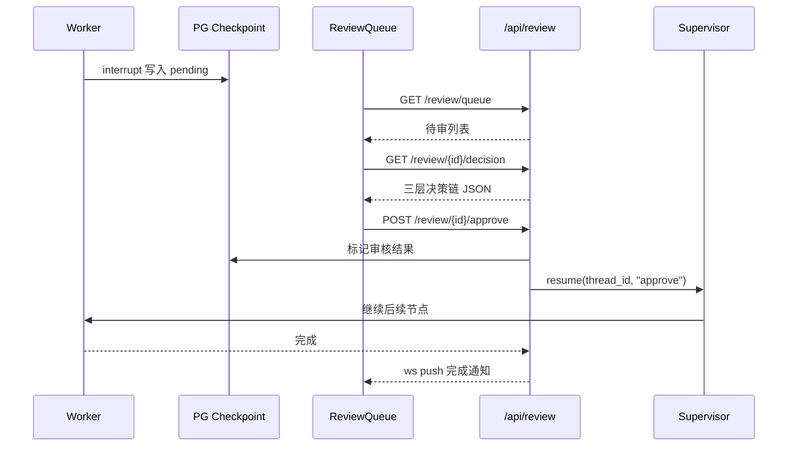
```mermaid
sequenceDiagram
    participant W as Worker
    participant PG as PG Checkpoint
    participant FE as ReviewQueue
    participant API as /api/review
    participant SUP as Supervisor

    W->>PG: interrupt 写入 pending
    FE->>API: GET /review/queue
    API-->>FE: 待审列表
    FE->>API: GET /review/{id}/decision
    API-->>FE: 三层决策链 JSON
    FE->>API: POST /review/{id}/approve
    API->>PG: 标记审核结果
    API->>SUP: resume(thread_id, "approve")
    SUP->>W: 继续后续节点
    W-->>API: 完成
    API-->>FE: ws push 完成通知
```

### 5.4 灰度路由 → 用户落版本

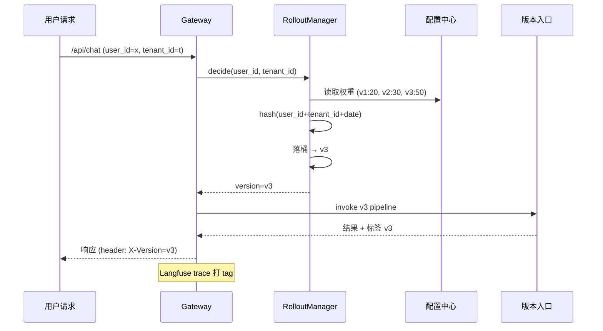
```mermaid
sequenceDiagram
    participant U as 用户请求
    participant API as Gateway
    participant RM as RolloutManager
    participant CFG as 配置中心
    participant V as 版本入口

    U->>API: /api/chat (user_id=x, tenant_id=t)
    API->>RM: decide(user_id, tenant_id)
    RM->>CFG: 读取权重 (v1:20, v2:30, v3:50)
    RM->>RM: hash(user_id+tenant_id+date)
    RM->>RM: 落桶 → v3
    RM-->>API: version=v3
    API->>V: invoke v3 pipeline
    V-->>API: 结果 + 标签 v3
    API-->>U: 响应 (header: X-Version=v3)
    Note over API: Langfuse trace 打 tag
```

### 5.5 异步批量任务 → Celery

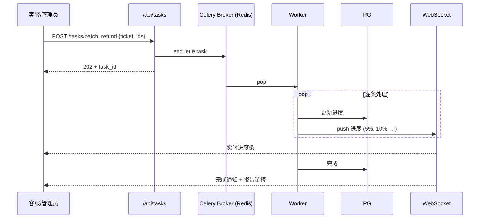
```mermaid
sequenceDiagram
    participant ADM as 客服/管理员
    participant API as /api/tasks
    participant CEL as Celery Broker (Redis)
    participant WK as Worker
    participant DB as PG
    participant WS as WebSocket

    ADM->>API: POST /tasks/batch_refund {ticket_ids}
    API->>CEL: enqueue task
    API-->>ADM: 202 + task_id
    CEL->>WK: pop
    loop 逐条处理
      WK->>DB: 更新进度
      WK->>WS: push 进度 (5%, 10%, ...)
    end
    WS-->>ADM: 实时进度条
    WK->>DB: 完成
    WS-->>ADM: 完成通知 + 报告链接
```

---

## 6. 20 条 User Story（F-01 ~ F-20）

> 每条结构：**Story / 触发点 / 主流程 / 异常分支 / AC（含反向用例）**

### F-01 登录 + JWT 鉴权（P0 / 全角色）

- **Story**：As 任意角色 用户，I want 输入账号密码登录系统，So that 我能进入对应角色的工作台
- **触发点**：访问任意非 `/login` 页面且无有效 token
- **主流程**：
  1. 跳转 `/login`
  2. 输入账号/密码 → POST `/auth/login`
  3. 后端校验 → 返 access_token (30min) + refresh_token (7d)
  4. 前端写 localStorage，按角色路由到默认落地页
- **异常分支**：账号错/密码错/账号停用/租户停用/超频限
- **AC（含反向）**：
  - ✅ 正确凭证返 200 + token
  - ❌ 错密码 401，连续 5 次锁 5 分钟
  - ❌ 停用账号 403 + 提示"账号已停用"
  - ❌ 已停用租户的用户 403
  - ✅ token 过期 → axios 拦截器自动 refresh，无感
  - ❌ refresh_token 也过期 → 跳 `/login` 并保存 redirect_to

### F-02 RBAC 按钮 + 接口控制（P0 / 全角色）

- **Story**：As 顾客，I want 我看不到风控/管理员菜单，So that 界面干净不被误导
- **触发点**：登录后任意页面渲染
- **主流程**：
  1. 后端在 `/auth/me` 返 `permissions: ["chat:send", "order:read_own", ...]`
  2. 前端 `v-permission` 指令按列表渲染
  3. 后端每个端点 `Depends(require_perm("xxx"))`
- **AC（含反向）**：
  - ✅ 顾客菜单只看到聊天/订单/工单
  - ❌ 顾客直接访问 `/admin` → 跳 403 页面
  - ❌ 顾客构造 curl 调 `/api/admin/rollout` → 后端 403
  - ✅ 403 文案与"无该按钮" 行为一致（不暴露端点存在性）
  - ✅ 角色变更 → 下次 `/auth/me` 刷新生效

### F-03 多租户切换与隔离（P0 / 管理员、客服）

- **Story**：As 客服，I want 切换租户后只看到该租户工单，So that 不会误处理他租户数据
- **触发点**：顶栏 TenantSelector 切换
- **主流程**：
  1. 切换 → 写入 localStorage.current_tenant
  2. 后续所有 API 自动带 `X-Tenant-Id` header
  3. 后端中间件校验 + 数据层 where tenant_id = X
- **AC（含反向）**：
  - ✅ A 租户查询 `/orders` 不含 B 租户数据
  - ❌ 手动改 header 为非授权租户 → 404
  - ❌ SQL 注入尝试 tenant_id → ORM 参数化兜住
  - ✅ 跨租户查询日志记入 Langfuse（安全审计）

### F-04 知识问答（RAG）（P0 / 顾客）

- **Story**：As 顾客，I want 问售后政策得到带引用的答案，So that 我能溯源相信
- **触发点**：ChatView 用户消息且 intent=knowledge
- **主流程**：见 §5.1 时序图
- **AC（含反向）**：
  - ✅ "耳机能 7 天无理由吗" → 答案包含至少 1 个 citation 卡片
  - ✅ 引用可点开看原文段落，高亮命中片段
  - ❌ KB 完全无相关 → 答 "未在政策中找到" + 引导转人工
  - ✅ 流式输出，1s 内首字
  - ✅ trace 包含 retriever / rerank / generation 3 阶段

### F-05 查单 / 物流跟踪（P0 / 顾客、客服）

- **Story**：As 顾客，I want 查询自己订单状态和物流，So that 知道何时到货
- **触发点**：消息含订单号，或 OrderListView 点击
- **主流程**：intent=order_query → ticket_handler → MCP tool `query_order` / `query_logistics` → 返回结构化卡片
- **AC（含反向）**：
  - ✅ 自己订单返完整字段
  - ❌ 查他人订单号 → 404 + 不暴露存在
  - ❌ 跨租户订单 → 404
  - ✅ 物流空数据 → 显示 "暂未发货"

### F-06 退款申请（含 7 天规则）（P0 / 顾客）

- **Story**：As 顾客，I want 申请退款，So that 不满意能获得退款
- **触发点**：消息含退款意图 / OrderListView 操作 / RefundFormView 提交
- **主流程**：
  1. 校验 7 天内 + 状态可退
  2. 走三层风控
  3. 通过 → 创建退款工单
  4. 高风险 → Interrupt → 人审
- **AC（含反向）**：
  - ✅ 7 天内 + 正常 → 提交成功
  - ❌ 超 7 天 → 拒绝 + 原因 "已超 7 天无理由期"
  - ❌ 订单非已签收 → 拒绝
  - ❌ 已退过 → 拒绝
  - ✅ 高风险 → 提示 "需人工审核" 不直接退

### F-07 改地址申请（P1 / 顾客）

- **Story**：As 顾客，I want 修改未发货订单收货地址，So that 收货顺利
- **触发点**：消息含改地址意图
- **主流程**：
  1. 校验订单状态（已支付未发货）
  2. 提取新地址 → 二次确认（**Interrupt 询问**）
  3. 用户确认 → 更新
- **AC（含反向）**：
  - ✅ 状态合规 + 用户二次确认 → 成功
  - ❌ 已发货 → 拒绝 + 引导改派
  - ❌ 跨省地址跳变 → 触发风控复核
  - ✅ Interrupt 期间 PG 持久化，刷新页面 resume 可继续

### F-08 Planner 复杂任务拆步（P0 / 系统）

- **Story**：As 系统，I want 把"退两件其中一件换地址再发"拆成可执行步骤，So that 多 agent 能协作完成
- **触发点**：意图数 > 1 或涉及多商品/金额
- **主流程**：见 §5.2
- **AC（含反向）**：
  - ✅ 多动作正确拆分（顺序 / 依赖 / 参数填充）
  - ✅ 输出符合 Pydantic schema
  - ❌ 模型胡乱输出 → schema 校验失败 → 重试最多 2 次
  - ❌ 第 3 次仍失败 → 兜底转人工 + 报警
  - ✅ trace 记录每次重试

### F-09 Critic 交叉校验（P0 / 系统）

- **Story**：As 系统，I want Critic 对 ticket/risk 输出做交叉校验，So that 关键错误不流出
- **触发点**：ticket_handler 或 risk_review 完成后
- **主流程**：Critic 检查金额一致/政策合规/字段完整 → approve / revise / escalate
- **AC（含反向）**：
  - ✅ 金额与订单不符 → revise 回退最多 2 次
  - ✅ 命中政策禁止条款 → escalate
  - ❌ revise 3 次仍不一致 → 强制 escalate 给人审
  - ✅ trace 记录每次 critic 决策与理由

### F-10 三层融合风控 + 决策链（P0 / 风控、系统）

- **Story**：As 风控员，I want 看到为什么这笔退款被判高风险，So that 我能解释和复核
- **触发点**：退款金额 / 频次 / 用户特征触发评分
- **主流程**：rules + features + llm → fusion → RiskDecision
- **AC（含反向）**：
  - ✅ 高风险单在 ReviewQueue 出现
  - ✅ 决策链树形展开三层证据 + 加权分
  - ✅ 命中规则可点击跳规则定义页（管理员）
  - ❌ 三层全 0 但融合非 0 → schema 校验失败 → 报错
  - ✅ LLM 不可用降级到 rules+features，trace 打 tag

### F-11 人审队列 + Interrupt resume（P0 / 风控、客服）

- **Story**：As 风控员，I want Approve 后工作流自动继续，So that 我不用手动触发后续
- **触发点**：决策链页面 Approve / Reject
- **主流程**：见 §5.3
- **AC（含反向）**：
  - ✅ Approve → 后端 resume → ticket 状态变 resolved
  - ✅ Reject → 工单 closed + 通知顾客
  - ❌ 重复 Approve（双击） → 幂等
  - ❌ 已处理过 → 二次打开按钮置灰
  - ✅ resume 失败 → 写入 dead_letter 表 + 告警

### F-12 灰度三版本路由（P0 / 系统、管理员）

- **Story**：As 系统，I want 同一 user_id+tenant_id 稳定落到同一版本，So that 用户体验一致
- **触发点**：每次 /api/chat 入口
- **主流程**：见 §5.4
- **AC（含反向）**：
  - ✅ 同 user+tenant 100 次请求落同一版本
  - ✅ 权重 v3=0 时无 v3 流量
  - ✅ trace 包含 version tag
  - ❌ 配置缺失 → 兜底 v3
  - ✅ 切流秒级生效（不重启）

### F-13 A/B 对比看板（P1 / 管理员）

- **Story**：As 管理员，I want 实时看 v1/v2/v3 关键指标对比，So that 决定是否扩 v3 流量
- **AC（含反向）**：
  - ✅ 三版本意图准确率/E2E完成率/平均 token/平均延迟 实时分组
  - ✅ 任一版本无流量 → 显示 "暂无数据"
  - ✅ 数据滞后 ≤ 60s
  - ❌ 跨租户用户不能看全局只能看本租户

### F-14 模型路由（P1 / 系统）

- **Story**：As 系统，I want 简单 query 走便宜模型，So that 总成本下降
- **AC（含反向）**：
  - ✅ "你好" → DeepSeek/Qwen-Turbo
  - ✅ Planner 决策 → Claude/GPT-4o
  - ❌ 配置缺失 → 兜底默认模型
  - ✅ 路由决策写入 trace tag

### F-15 语义缓存（P1 / 系统）

- **Story**：As 系统，I want 相似 query 命中缓存，So that 减少重复 LLM 调用
- **AC（含反向）**：
  - ✅ 相似 query (sim > 0.95) 二次访问 < 500ms
  - ❌ 金额相关/风控场景豁免（不缓存）
  - ✅ 命中时 trace 打 cache_hit=true
  - ✅ 缓存命中率面板可见

### F-16 Celery 批量退款审核（P1 / 客服、管理员）

- **Story**：As 客服，I want 触发批量退款审核后台异步跑，So that 不阻塞界面
- **AC（含反向）**：
  - ✅ 提交后立返 task_id
  - ✅ 前端进度条逐条更新
  - ❌ 单条失败不影响其他
  - ✅ 任务可中止（标记停止 flag）
  - ✅ 失败可重试（重发同 task_id）

### F-17 实时 trace 看板（P0 / 管理员）

- **Story**：As 管理员，I want 在 Langfuse 看到完整 trace 树，So that 定位慢/贵/错调用
- **AC（含反向）**：
  - ✅ 每次 /api/chat 在 Langfuse 有完整 trace
  - ✅ trace 含 retriever / rerank / agent / llm 各阶段耗时与 token
  - ❌ Langfuse 不可达 → 本地降级日志，trace 异步重试

### F-18 评测报告产出（P0 / 系统）

- **Story**：As 工程师，I want `make eval` 产出 markdown 报告，So that 量化迭代效果
- **AC（含反向）**：
  - ✅ 一键跑出 v1/v2/v3 对比表
  - ✅ 含意图准确率/RAG Top1/风控 F1/E2E 完成率/平均 token/平均延迟
  - ✅ 数据集异常 → 跳过该样本并报告
  - ✅ 报告时间戳 + git commit 自动写入

### F-19 MCP 对外 stdio（P1 / 系统）

- **Story**：As 外部 Agent (Claude Desktop)，I want 通过 MCP 调本系统工具，So that 我能复用查单/查 KB 能力
- **AC（含反向）**：
  - ✅ Claude Desktop 配置接入 → query_order 返回数据
  - ✅ tools/list 至少含 query_order / list_refunds / get_kb_doc / risk_check
  - ❌ 未授权租户调用 → 拒绝
  - ✅ 协议错误返标准 JSON-RPC error

### F-20 租户管理 CRUD（P1 / 管理员）

- **Story**：As 管理员，I want 新建/停用/改配额，So that 应对客户接入
- **AC（含反向）**：
  - ✅ 新建后立即可用
  - ✅ 停用后该租户所有用户 next 请求 → 403
  - ❌ 删除（不做，仅停用）
  - ✅ 改配额超限请求 → 429

---

## 7. 数据流与状态机

### 7.1 工单状态机

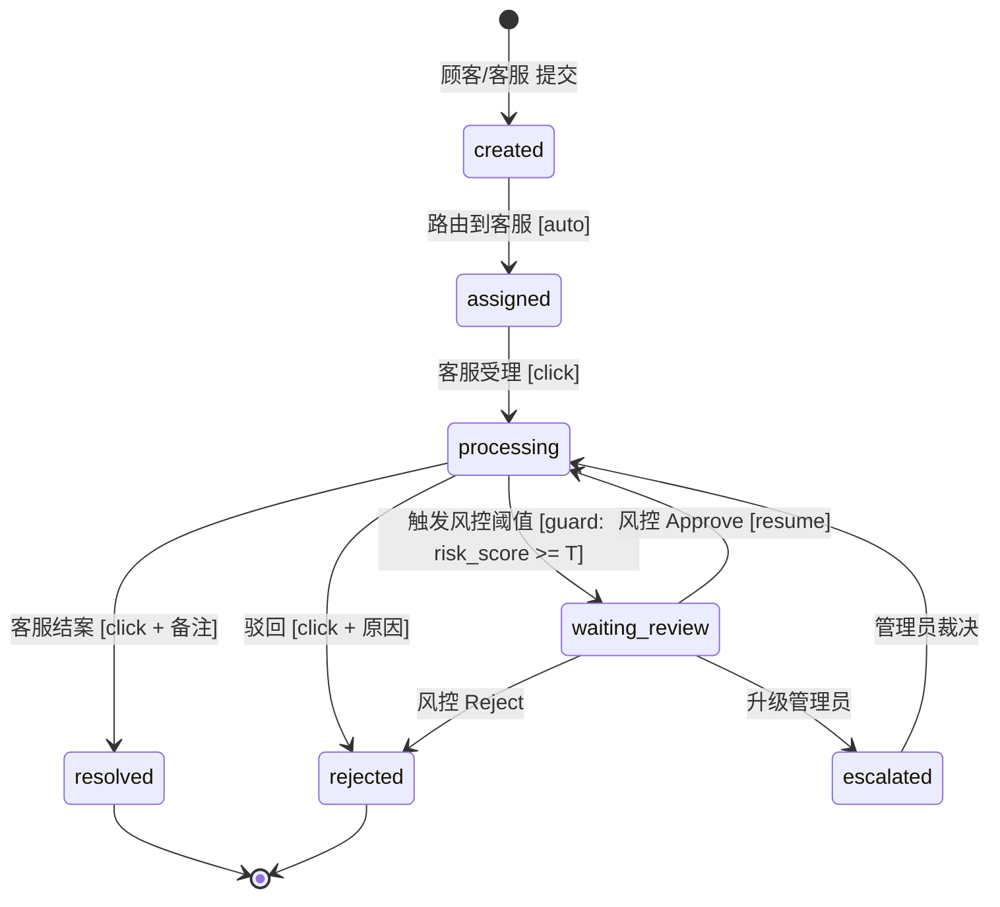
```mermaid
stateDiagram-v2
    [*] --> created : 顾客/客服 提交
    created --> assigned : 路由到客服 [auto]
    assigned --> processing : 客服受理 [click]
    processing --> waiting_review : 触发风控阈值 [guard: risk_score >= T]
    processing --> resolved : 客服结案 [click + 备注]
    processing --> rejected : 驳回 [click + 原因]
    waiting_review --> processing : 风控 Approve [resume]
    waiting_review --> rejected : 风控 Reject
    waiting_review --> escalated : 升级管理员
    escalated --> processing : 管理员裁决
    resolved --> [*]
    rejected --> [*]
```

### 7.2 退款单状态机

```mermaid
stateDiagram-v2
    [*] --> applied : 顾客提交
    applied --> risk_pending : 三层风控 [guard: score >= T]
    applied --> approved : 低风险 [guard: score < T]
    risk_pending --> approved : 人审 Approve
    risk_pending --> denied : 人审 Reject
    approved --> refunding : 调支付通道 (mock)
    refunding --> done : 成功
    refunding --> failed : 失败 [retry x3]
    failed --> refunding : 重试
    failed --> denied : 重试耗尽
    done --> [*]
    denied --> [*]
```

### 7.3 Interrupt 工作流状态

```mermaid
stateDiagram-v2
    [*] --> running
    running --> interrupted : trigger interrupt [save checkpoint]
    interrupted --> reviewing : 人审拉取
    reviewing --> resumed : approve [load checkpoint]
    reviewing --> aborted : reject
    resumed --> running
    running --> completed
    completed --> [*]
    aborted --> [*]
```

### 7.4 灰度路由数据流

```mermaid
flowchart LR
    Req[/api/chat 请求/]
    Hash[hash(user_id + tenant_id + date)]
    Bucket[取模落桶 0-99]
    CFG[读权重 v1:20 v2:30 v3:50]
    Decide{落版本}
    Pipe1[v1 pipeline]
    Pipe2[v2 pipeline]
    Pipe3[v3 pipeline]
    Trace[Langfuse tag version=X]
    Req --> Hash --> Bucket --> CFG --> Decide
    Decide -- 0-19 --> Pipe1
    Decide -- 20-49 --> Pipe2
    Decide -- 50-99 --> Pipe3
    Pipe1 --> Trace
    Pipe2 --> Trace
    Pipe3 --> Trace
```

---

## 8. MVP / 演示脚本（12 条端到端剧本）

> 每条 = 演示者操作 → 系统响应 → 期望结果 → 截图/录屏点。
> 顺序为推荐演示顺序，从易到难。

### 演示 1：知识问答（F-04）

| 步骤 | 操作 | 期望响应 | 截图点 |
|---|---|---|---|
| 1 | 顾客登录 demo_user_001 / 123456 | 落 ChatView | login_to_chat |
| 2 | 输入"上周买的蓝牙耳机能 7 天无理由吗" | 流式答案 + 引用卡片 | chat_streaming |
| 3 | 点击引用卡片 | 抽屉展开 KB 原文 + 高亮 | citation_drawer |
| 4 | 打开 Langfuse | 看到 retriever→rerank→llm 完整 trace | trace_tree |

### 演示 2：简单业务 - 查单（F-05）+ 跨租户拒绝（F-03）

| 步骤 | 操作 | 期望响应 |
|---|---|---|
| 1 | 输入"查订单 ORD-A-12345"（属于本租户） | 返回订单详情卡片 |
| 2 | 输入"查订单 ORD-B-99999"（属于他租户） | "未找到该订单" 而非 403 |

### 演示 3：复杂业务（F-08 / F-09）

| 步骤 | 操作 | 期望响应 |
|---|---|---|
| 1 | 输入"我要退两件商品，其中一件换地址再发" | Planner 拆 3 步 |
| 2 | - | 步骤 1 退款 A，步骤 2 改地址，步骤 3 重发 |
| 3 | Critic 校验 | 三步串行执行无冲突 |
| 4 | 完成 | 工单号 + 进度卡片 |

### 演示 4：风控触发 → 决策链 → resume（F-06 / F-10 / F-11）

| 步骤 | 操作 | 期望响应 |
|---|---|---|
| 1 | 顾客发起退款 999 元 | 三层融合打分 87 → Interrupt |
| 2 | 切到风控账号 | ReviewQueue 看到该单 |
| 3 | 点开决策链 | 三层证据展开 + 融合分 |
| 4 | 点 Approve | 工作流 resume → 工单 resolved |
| 5 | 切回顾客 | 收到处理完成通知 |

### 演示 5：模型路由（F-14）

| 步骤 | 操作 | 期望响应 |
|---|---|---|
| 1 | 输入"你好" | 走 DeepSeek（trace 验证） |
| 2 | 输入复杂多动作请求 | 走 Claude/GPT-4o |
| 3 | Langfuse 看 model tag | 区分清楚 |

### 演示 6：语义缓存（F-15）

| 步骤 | 操作 | 期望响应 |
|---|---|---|
| 1 | 第一次问"耳机能退吗" | trace 无 cache_hit，耗时 2s |
| 2 | 换说法"耳机可不可以退" | trace cache_hit=true，耗时 < 500ms |
| 3 | 问退款 999 元 | 不命中缓存（豁免） |

### 演示 7：异步任务（F-16）

| 步骤 | 操作 | 期望响应 |
|---|---|---|
| 1 | 客服选 50 条工单点"批量审核" | 返 task_id + 跳进度页 |
| 2 | 观察进度条 | 5% → 10% → ... → 100% |
| 3 | 完成 | 显示成功/失败明细 |

### 演示 8：灰度对比（F-12 / F-13）

| 步骤 | 操作 | 期望响应 |
|---|---|---|
| 1 | 管理员打开 RolloutView | v1:20 v2:30 v3:50 |
| 2 | 把 v3 拖到 0 | 滑块即时反映 |
| 3 | 切到 AdminDashboard | v3 流量曲线下降到 0 |
| 4 | 改回 50 | v3 流量回升 |

### 演示 9：多租户隔离（F-03）

| 步骤 | 操作 | 期望响应 |
|---|---|---|
| 1 | A 租户管理员登录 | 看 5 个 mock 工单 |
| 2 | 用 curl 构造 X-Tenant-Id=B 请求 | 403/404 |
| 3 | B 租户管理员登录 | 看不同的工单集 |

### 演示 10：观测全链路（F-17）

| 步骤 | 操作 | 期望响应 |
|---|---|---|
| 1 | 顺次跑演示 1-9 | 每个 case 都在 Langfuse 有 trace |
| 2 | 打开复杂业务 trace | 看到 Planner→Critic→各 Agent 完整树 |
| 3 | 看成本面板 | 按版本/模型/Agent 分组明细 |

### 演示 11：评测报告（F-18）

| 步骤 | 操作 | 期望响应 |
|---|---|---|
| 1 | 终端 `make eval` | 跑 200 条评测用例 |
| 2 | 打开 `eval_report.md` | 三版本对比表 + 图 |
| 3 | 看 CI | PR 自动评论评测摘要 |

### 演示 12：MCP 对外（F-19）

| 步骤 | 操作 | 期望响应 |
|---|---|---|
| 1 | Claude Desktop 配 `mcp.json` 指向本系统 | 自动发现 4 个工具 |
| 2 | 在 Claude 中问"帮我查 ORD-A-12345" | Claude 调 query_order → 返数据 |
| 3 | 录屏 30s | 放 README |

---

## 9. 边界与约束（UI 层不做）

- 国际化（仅中文）
- 暗黑模式（默认浅色）
- 无障碍 a11y（仅基础 alt/aria，不做 WCAG 全套）
- 移动端适配（仅做 PC ≥ 1280px）
- 浏览器兼容仅 Chrome ≥ 110 / Edge ≥ 110
- 富文本编辑器（备注框纯文本）
- 头像上传（用默认头像）
- 实时音视频
- 离线模式 / PWA

---

## 10. 变更记录

| 日期 | 修改人 | 摘要 |
|---|---|---|
| 2026-05-25 | brainstorm 阶段 | 初稿。10 节结构、4 角色 wireframe、20 条 user story（含反向用例）、4 个状态机、5 个时序图、12 条演示剧本 |
